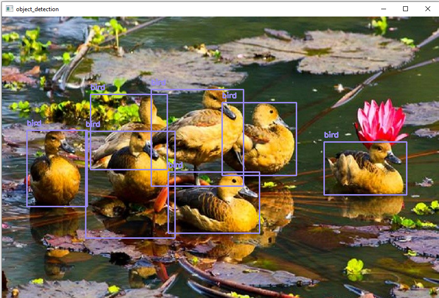
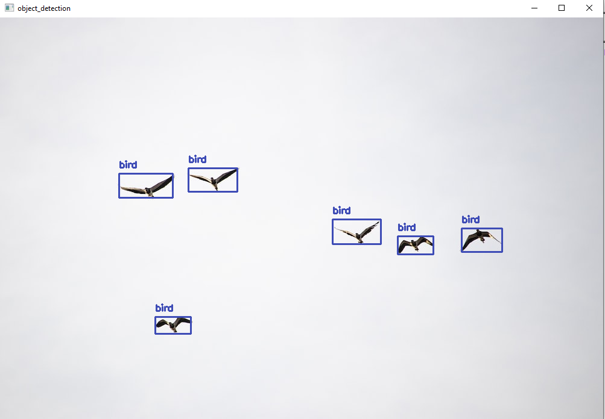
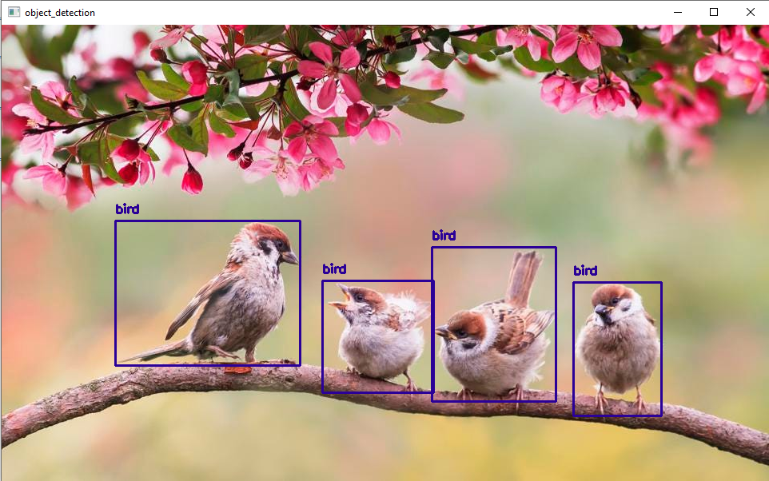
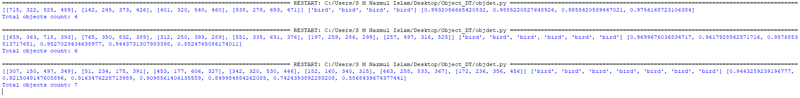

# Object detection using OpenCV, Tensorflow and cvlib (YOLO trained). 
## cvlib
A simple, high level, easy-to-use open source Computer Vision library for Python.

## Installation

### Installing dependencies

Provided the below python packages are installed, cvlib is completely pip installable.

* OpenCV
* TensorFlow

If you don't have them already installed, you can install through pip

`pip install opencv-python tensorflow` 

### Installing cvlib

`pip install cvlib`

To upgrade to the newest version
`pip install --upgrade cvlib`

## How to Run

Just open the objdet.py file with idle and run the code

Make sure you are reading your testing image. For that just update the line

`image = cv2.imread('Images\\input1.jpg')`

by `image = cv2.imread('your image')` 

## Output

 
Underneath it uses [YOLOv4](https://github.com/AlexeyAB/darknet) model trained on [COCO dataset](http://cocodataset.org/) capable of detecting 80 [common objects](https://github.com/arunponnusamy/object-detection-opencv/blob/master/yolov3.txt) in context.

